# 소랑제주 공공데이터·Appwrite 구조

## 목표

장소 6개짜리 번들 목록을 공식 관광정보 기반의 지속 갱신 데이터로 전환한다. 앱은 Appwrite에 동기화된 장소를 우선 사용하고, 네트워크 장애 시 마지막 정상 캐시, 최초 설치·미연결 환경에서는 번들 기본 데이터를 사용한다.

## 허용 데이터 원칙

- 한국관광공사 `국문 관광정보 서비스_GW(KorService2)`의 제주 법정동 시·도 코드 `lDongRegnCd=50`을 1차 관광정보·이미지 소스로 사용한다.
- 기존 제주어 네 종류 자료는 제주특별자치도 제주어 OpenAPI를 계속 사용한다.
- 비짓제주 API는 활용 승인과 응답 스키마를 확인한 뒤 보조 소스로 추가한다.
- 제3자 블로그·SNS·네이버 플레이스 후기와 이미지는 수집하거나 재게시하지 않는다.
- 각 장소에는 원천 ID, 제공기관, 원문 링크, 이미지 목록, 저작권 구분, 원천 수정일, 수집 시각을 보존한다.
- 이미지 파일을 Appwrite Storage에 복제하는 기능은 원천별 재배포 조건을 검증한 뒤에만 활성화한다. 현재는 공식 원본 URL과 메타데이터만 저장한다.

## 처리 흐름

```mermaid
flowchart LR
  A["한국관광공사 TourAPI"] --> B["Appwrite 예약 Function"]
  B --> C["places 공개 읽기 전용 테이블"]
  B --> D["sync_runs 운영 상태"]
  C --> E["Expo 앱 · React Native SDK"]
  E --> F["AsyncStorage 마지막 정상 캐시"]
  G["번들 기본 장소"] --> E
```

## Appwrite 리소스

- Project ID: `6a615d4e00392e50bbd8`
- Database: `jeju`
- Table: `places` — `read("any")`만 허용하고 일반 클라이언트 쓰기는 금지
- Table: `sync_runs` — 실행별 수집 성공·실패·처리 건수 기록, 공개 권한 없음. `runId`를 행 ID로 사용해 과거 실행을 보존한다.
- Function: `collect-jeju-tourism`
- Schedule: 매일 `30 2 * * *` (Appwrite 서버 표준시간을 확인해 한국 시각으로 조정)
- Function scope: `rows.read`, `rows.write`
- Secret: `TOUR_API_SERVICE_KEY`는 Function 변수로만 보관

## 초기 연결

1. Appwrite 프로젝트 `6a615d4e00392e50bbd8`과 대상 팀이 맞는지 확인한다.
2. `appwrite client --endpoint https://appwrite.uulab.co.kr/v1 --project-id <PROJECT_ID>`로 대상을 확인한다.
3. `npm run appwrite:push`로 테이블과 Function을 배포한다.
4. Function 변수 `TOUR_API_SERVICE_KEY`를 등록한다.
5. `{"smoke":true}` 실행으로 연결을 점검한 후 관광지는 `npm run appwrite:collect:tourism:full`, 제주어는 `npm run appwrite:collect`로 최초 수집한다. 관광지의 이후 수동 증분 실행은 `npm run appwrite:collect:tourism`을 사용한다.
6. 앱 클라이언트의 endpoint와 project ID는 `src/lib/appwrite.ts`에 고정되어 있으며, 앱 시작 시 `client.ping()`으로 연결을 확인한다.

## 운영 자동 점검

- `npm run data:health`는 두 수집 Function의 enabled/live·예약 스케줄·최신 배포 상태, 최신 실행과 예약 실행 복구 여부, `sync_runs`·`places`·`culture_items`의 실제 원격 데이터를 확인한다. API 키나 수집 데이터가 없거나 복구되지 않은 Function 실패가 있으면 성공으로 처리하지 않는다.
- `sync_runs`는 수집 실행마다 `sync-<시각>` 행을 추가한다. `source`는 비고유 인덱스로만 조회하고, `finishedAt` 인덱스로 최신 실행을 찾는다. 운영 이력은 덮어쓰지 않는다.
- `.github/workflows/data-health.yml`은 매일 실행되며, 저장소 Secrets에 `APPWRITE_ENDPOINT`, `APPWRITE_PROJECT_ID`, `APPWRITE_DATABASE_ID`, `APPWRITE_API_KEY`를 등록하면 수집 중단을 자동으로 감지한다.
- 원격 수집 Function에는 `TOUR_API_SERVICE_KEY`를 Secret 변수로 등록해야 한다. 이 값은 앱 번들·Git 저장소·CI 로그에 넣지 않는다.
- 네트워크 오류는 두 수집 Function과 앱의 Appwrite 조회 모두 타임아웃·재시도·캐시 보존으로 처리한다. 두 수집 Function은 런타임 내부 Appwrite API가 연결되지 않거나 재시도 가능한 408·425·429·5xx를 반환하면 고정된 공개 Endpoint로 전환한다. TourAPI나 제주어 수집 응답이 비정상적으로 0건(또는 최소 건수 미만)이면 기존 Appwrite 데이터를 보존하고 실패 기록만 남긴다.
- 제주어 수집 Function은 최초 1회만 `page=1..n`, `pageSize=1000`으로 원천 응답을 나누고, 이후에는 `sync_runs.checkpointJson`의 마지막 `seq`보다 큰 신규 항목만 읽는다. 신규 항목이 없으면 리소스별 첫 페이지에서 멈추며, 각 페이지의 ID를 중복 제거하고 최대 100페이지 보호선을 둔다. 일부 저장이 실패하면 체크포인트를 진행시키지 않아 다음 실행에서 누락 항목을 다시 수집한다.
- 관광정보 수집 Function은 최초 1회만 `areaBasedList2`로 기본 목록을 채웁니다. 이후에는 `areaBasedSyncList2`에 마지막 성공 체크포인트의 `modifiedtime`과 `lDongRegnCd=50`을 보내 신규·수정·비표출 항목만 읽습니다. 저장된 원천 수정일이 같으면 상세 API 호출을 생략하고, `showflag=0` 또는 `oldContentid`는 삭제 대신 비활성화로 반영합니다.
- 앱의 제주어 `culture_items` 조회는 `$id` 커서 기반 20건 페이징을 사용한다. 검색은 Appwrite full-text 인덱스를 사용하고, 화면 끝에서 다음 20건만 추가한다.
- 앱의 `places` 조회는 `$id` 커서 기반 100건 페이징을 사용해 큰 offset 스캔을 피하고, 최대 2,000건까지만 화면 캐시에 적재한다. 현재 수집 상한(`TOUR_API_MAX_ITEMS=300`)보다 충분히 큰 값이다.
- 정상 수집 뒤 현재 응답에 없는 기존 TourAPI 장소는 삭제하지 않고 `active=false`, `retiredAt`로 비활성화한다. 다음 수집에서 다시 나타나면 upsert로 복구된다.
- TourAPI가 401/403을 반환하면 실행 상태를 `auth_error`로 기록하고 해당 실행에서는 즉시 중단한다. 예약 실행은 유지하되, 헬스체크에서 개발계정 키의 승인·활성화 상태 확인을 안내한다.

Appwrite 서버 키는 프로젝트의 서버 전용 `.env`에 `APPWRITE_API_KEY`로 저장한다. 앱 번들에서 참조하지 않으며 `EXPO_PUBLIC_*` 이름을 사용하지 않는다. 공공데이터 API 키도 Function 변수로만 관리한다.
